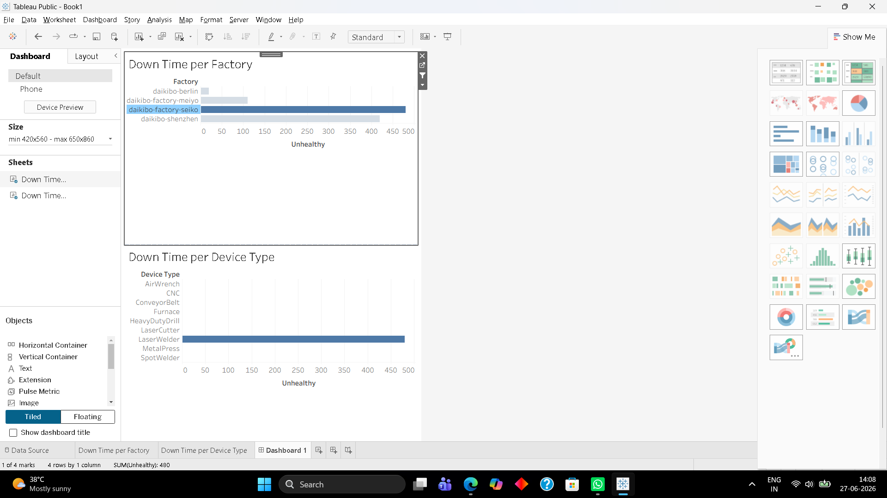

# Deloitte Data Analytics Job Simulation

## Overview

This repository contains my solution to the Deloitte Data Analytics Virtual Experience Program by Deloitte on Forage.

The project demonstrates practical data analytics skills using Tableau and Microsoft Excel to analyze business data and present insights through interactive dashboards.

---

## Tools Used

- Tableau
- Microsoft Excel
- GitHub

---

## Task 1 – Tableau Dashboard

### Objective

Analyze factory telemetry data and identify downtime across factories and device types.

### Dashboard Preview

### Key Insights

- Built an interactive dashboard using Tableau.
- Created a calculated field (**Unhealthy**) to measure machine downtime.
- Compared downtime across multiple factories.
- Used dashboard actions to filter device-level downtime by selected factory.

---

## Task 2 – Equality Score Classification

### Objective

Classify employee equality scores into business categories.

### Categories

- **Fair** (−10 to +10)
- **Unfair** (−20 to <−10 and >10 to 20)
- **Highly Discriminative** (<−20 or >20)

The completed Excel file is included in this repository.

---

## Repository Contents

- `tableau-dashboard.png` – Tableau dashboard screenshot
- `Task 5 Equality Table Completed.xlsx` – Completed Excel task
- `deloitte certificate.pdf` – Certificate of completion

---

## Skills Demonstrated

- Data Analysis
- Tableau
- Microsoft Excel
- Data Visualization
- Dashboard Development
- Business Intelligence

---

## Author

**Satyam Kumar Singh**

B.Tech – Artificial Intelligence & Machine Learning
